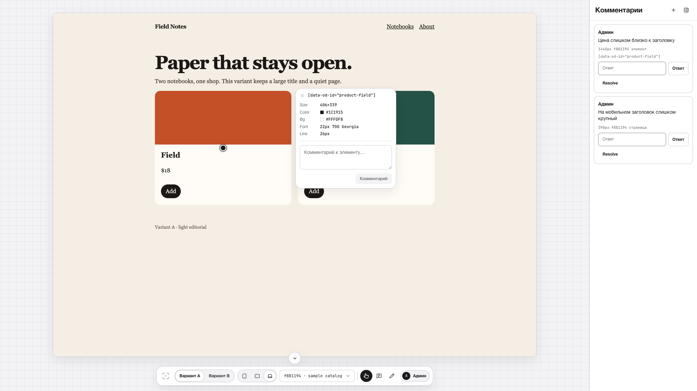

# Design Review Tool

[Русский](README.ru.md)

Self-hosted review for HTML that lives in git. An admin connects a repository, reviewers open a named login, and comments stick to an element, a highlight, or the page. React is only the frame around the preview. The design stays HTML in an iframe.



## Features

- Named reviewer accounts. No public signup.
- Live preview of a git commit, including private remotes via a deploy key.
- Variant switch (A/B), widths 390 / 768 / 1440.
- Three comment kinds: element pin, rectangle highlight, unanchored page note.
- JSON export of open threads for a person or an agent fixing the design.

## Run

```bash
cp .env.example .env
npm install
npm test
npm run build:web
ADMIN_PASSWORD=... SESSION_SECRET=... npm run dev
```

`SESSION_SECRET` must be at least 16 characters. Open `http://127.0.0.1:8787/admin`, create a project (git URL and variant folder paths), add a reviewer, press **Sync git**. The review URL is `/p/<slug>`.

Local cookies are not `Secure` (`COOKIE_SECURE=false`). After `web/` changes, run `npm run build:web` again. Restart the process after editing `src/bridge.js` or `src/pin-target.js`.

How to review, and how an agent applies comments: [docs/usage.en.md](docs/usage.en.md). Russian: [docs/usage.md](docs/usage.md). Agents working in this repository: [AGENTS.md](AGENTS.md).

The sample shop is in this repo. Point a project at `https://github.com/x950827/design-review-tool.git`, branch `main`, folders `examples/catalog/a` and `examples/catalog/b`, then press **Sync git**.

## Production

Pull the image. No clone, no build:

```bash
curl -fsSL -o compose.yaml \
  https://raw.githubusercontent.com/x950827/design-review-tool/main/compose.yaml
printf '%s\n' 'ADMIN_PASSWORD=choose-a-password' 'SESSION_SECRET=at-least-16-chars' > .env
docker compose up -d
```

Details, TLS, and a private git key: [docs/deploy.md](docs/deploy.md). Compose publishes `127.0.0.1:8787` only. The container listens on `0.0.0.0` inside the network. Do not bake passwords or an SSH key into the image.

## Contributing

Pull requests are accepted only from forks. See [CONTRIBUTING.md](CONTRIBUTING.md).

## Security

[SECURITY.md](SECURITY.md).

## License

[MIT](LICENSE). This repository is an application, not an npm library (`"private": true`).
